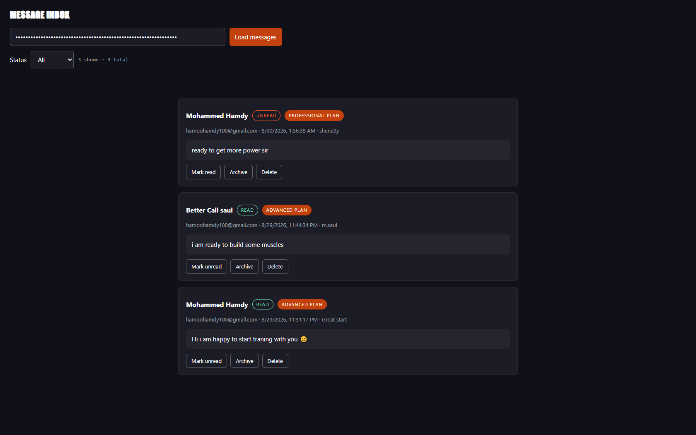
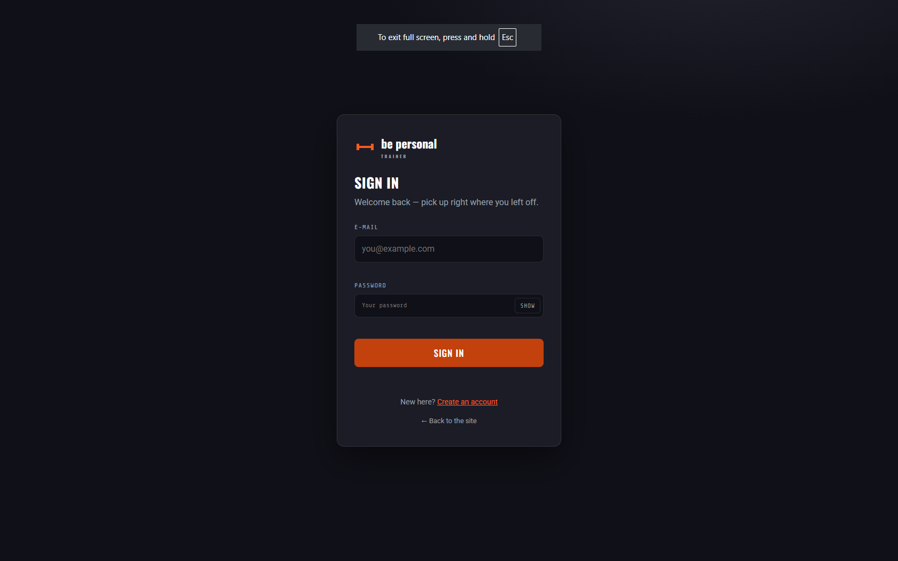
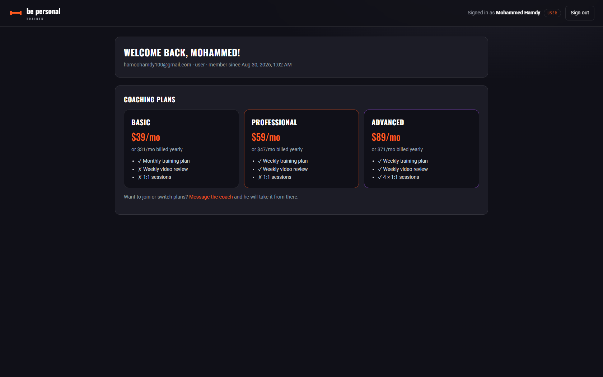

# be-personal-trainer-site

> Personal-training website for Brandon Ross — "Be Personal Trainer". Strength, conditioning and nutrition coaching in Melbourne or online. Vanilla HTML/CSS/JS landing page with PWA support — no build step for the frontend, plus a **Node.js + Express + SQLite backend** that powers the contact form, serves the plans/stats APIs, and provides an admin inbox.

---

### GitHub "About" (short version)

```
Personal-training site for Be Personal Trainer — strength, conditioning & nutrition coaching in Melbourne or online. Static frontend (no build step) + Express/SQLite backend with contact form, plans/stats APIs and an admin inbox.
```

---

## Overview

A single-page marketing site for **Be Personal Trainer**, the personal-training business of Brandon Ross, based in Melbourne (Level 13, 2 Elizabeth St).

The page covers:

- **Hero** — intro, animated progress ring and "varied training" card
- **Training** — 4-week beginner workout program timeline (Crossfit / Running / Crossfit + running)
- **About me** — Brandon's 12 years of coaching experience, certified strength & conditioning coach, nutrition L3
- **Services** — what's included (personal plan reviews every 2 weeks, form checks, nutrition targets)
- **E-training** — online plan options from $39/month
- **Contact** — **server-backed contact form** (validation, spam trap, rate limiting, SQLite persistence, optional e-mail), location and phone/email details

## Features

### Frontend

- **Zero dependencies, zero build step** — plain HTML, CSS and JavaScript
- **PWA-ready** — `site.webmanifest`, favicon + generated icons via `make_icons.py`
- **Performance focused**:
  - Preloaded hero image with `fetchpriority="high"` and aspect-ratio set (no CLS)
  - Non-blocking Google Fonts load
  - Lazy-loaded below-the-fold images with explicit `width`/`height`
- **Small interactions** (all in vanilla JS):
  - Sticky nav with shadow on scroll
  - Mobile burger menu with `aria-expanded`
  - Scroll-spy active link highlighting
  - Animated SVG progress rings on scroll into view
  - Scroll-reveal animations
  - Typewriter hero headline and a live running “progress dot” on the chart
  - Scroll-progress bar and back-to-top button
  - Animated stat counters (years, athletes, sessions, rating)
  - Monthly/Yearly billing toggle on the pricing cards
  - Mouse-follow 3D tilt on plan cards (hover devices, motion-safe)
  - Showreel video modal (YouTube embed) with Escape / backdrop close
  - Contact form with client- **and** server-side validation and inline error messages
- **Accessibility-minded** — semantic sections, `sr-only` labels, `aria-live` error regions, dialog `role`/`aria-modal`

### Backend

- **Serves the whole site** — one process hosts the static frontend *and* the API
- **`POST /api/contact`** — real contact form endpoint:
  - Server-side validation mirroring the client checks
  - Honeypot spam field + per-IP rate limiting (express-rate-limit)
  - Messages persisted to SQLite — never lost on restart
  - Optional SMTP e-mail notification (nodemailer) when `SMTP_HOST` is set
- **`GET /api/plans`** and **`GET /api/stats`** — pricing + coaching figures served as data; the frontend falls back to its baked-in markup if the API is unreachable
- **Admin inbox API** — `GET / PATCH / DELETE /api/messages` behind an API key
- **Plan capture** — "Buy now" buttons tag the message with the plan the visitor wants; shown in the admin inbox
- **Security first** — helmet headers, timing-safe key comparison, parameterized SQL, consistent JSON error codes
- **Zero native dependencies** — SQLite via Node's built-in `node:sqlite` (Node ≥ 22.5)
- **Tested** — 25+ tests with Node's built-in test runner

## Tech stack

| Layer                 | Tech                                                         |
| --------------------- | ------------------------------------------------------------ |
| Markup                | Semantic HTML5                                               |
| Styling               | CSS (custom properties, responsive layout)                   |
| Logic (frontend)      | Vanilla JavaScript (IntersectionObserver, fetch, etc.)       |
| API layer             | Node.js + Express 5                                          |
| Database              | SQLite via built-in `node:sqlite` (WAL mode)                 |
| Security              | helmet, express-rate-limit                                   |
| E-mail (optional)     | nodemailer (only if `SMTP_HOST` is set)                      |
| Icons                 | Hand-rolled inline SVG                                      |
| Image/icon generation | Python script (`make_icons.py`)                              |

## File structure

```
fit-site/
├── index.html          # Single-page site
├── styles.css          # All styling
├── script.js           # Interactivity + backend API calls
admin.html          # Admin message inbox (served by the backend)
├── site.webmanifest    # PWA manifest
├── favicon.svg         # SVG favicon source
├── icon.png            # PNG icon
├── make_icons.py       # Generates icon-192.png / icon-512.png
├── robots.txt
├── .gitignore
│
└── server/             # Node.js + Express backend
    ├── package.json
    ├── .env.example    # copy to .env and adjust
    ├── src/
    │   ├── index.js    # entry point (loads .env, starts the server)
    │   ├── app.js      # Express app factory (reused by tests)
    │   ├── config.js   # env parsing + defaults
    │   ├── db.js       # SQLite connection, schema, query API
    │   ├── seed.js     # default plans/stats (matches the site copy)
    │   ├── validate.js # contact-form validation
    │   ├── mailer.js   # optional SMTP notifications
    │   ├── middleware/ # auth + error handling
    │   └── routes/     # health, plans, stats, contact, messages
    └── test/           # API + integration tests (node:test)
```

## Getting started

### Option A — backend (recommended)

```bash
cd server
npm install
cp .env.example .env        # then edit .env — at least set ADMIN_API_KEY
npm start
```

Then open <http://localhost:3000>.

### Watch the inbox

Open <http://localhost:3000/admin.html> in the browser, paste the
`ADMIN_API_KEY` from `server/.env` and hit **Load messages**. You can filter
by status, mark read/unread, archive and delete.

## Reading messages (admin inbox)

Every contact-form submission is stored in SQLite together with the **plan**
the visitor clicked "Buy now" on, their IP and user agent. Two ways to read it:

### 1. Browser — `/admin.html`

```text
Start the server → open http://localhost:3000/admin.html
→ paste your ADMIN_API_KEY → "Load messages"
```

Messages show a **Plan badge** (e.g. "Professional plan") when the visitor
arrived from a plan's "Buy now" button.

### 2. REST API

```bash
curl http://localhost:3000/api/messages -H "X-Admin-Key: your-secret-key"

# filter by status / paginate
curl "http://localhost:3000/api/messages?status=unread&limit=50&offset=0" \
  -H "X-Admin-Key: your-secret-key"
```

PATCH and DELETE work on `/api/messages/:id` — see the API table below.

> **Note:** "Buy now" does **not** take payment — there is no checkout yet.
> Clicking it records which plan the visitor wants so the lead arrives already
> tagged with the plan. Actual payment processing is a separate feature.

### Option B — static only

```bash
# Python
python -m http.server 8000

# or Node
npx serve .
```

## API reference

All responses are JSON. Success is a plain object; errors follow
`{ "error": { "code", "message", ... } }`.

| Method | Endpoint            | Auth          | Description                                       |
| ------ | ------------------- | ------------- | -------------------------------------------------- |
| GET    | `/healthz`          | –             | Liveness + database check                          |
| GET    | `/api/plans`        | –             | Pricing tiers (Basic / Professional / Advanced)    |
| GET    | `/api/stats`        | –             | Coaching figures (12+, 500+, 15000+, 4.9★)         |
| POST   | `/api/contact`      | –             | Store a contact message                            |
| GET    | `/api/messages`     | `X-Admin-Key` | List messages (`?status=&limit=&offset=`)          |
| PATCH  | `/api/messages/:id` | `X-Admin-Key` | Set `{ "status": "read" \| "unread" \| "archived" }` |
| DELETE | `/api/messages/:id` | `X-Admin-Key` | Permanently delete a message                       |

Example — submit the contact form:

```bash
curl -X POST http://localhost:3000/api/contact \
  -H "Content-Type: application/json" \
  -d '{"name":"Jane Smith","email":"jane@example.com","subject":"1-on-1 sessions","message":"Hi, I would like to book a first session next week.","plan":"Professional"}'
```

Example — read the inbox:

```bash
curl http://localhost:3000/api/messages -H "X-Admin-Key: your-secret-key"
```

## Configuration (`server/.env`)

| Variable | Default | Meaning |
| -------- | ------- | ------- |
| `PORT` | `3000` | HTTP port |
| `HOST` | `127.0.0.1` | Bind address (`0.0.0.0` to expose the LAN) |
| `NODE_ENV` | `development` | `production` enables asset caching |
| `DATABASE_PATH` | `./data/fit-site.sqlite` | SQLite file (`:memory:` = ephemeral) |
| `ADMIN_API_KEY` | `change-me-before-deploying` | **change this!** protects `/api/messages` |
| `CONTACT_RATE_LIMIT_MAX` | `5` | Max contact posts per IP per window |
| `CONTACT_RATE_LIMIT_WINDOW_MS` | `600000` (10 min) | Rate-limit window |
| `SMTP_HOST` / `SMTP_PORT` / `SMTP_SECURE` / `SMTP_USER` / `SMTP_PASS` | *(empty)* | Enables e-mail notifications (leave empty to disable) |
| `SMTP_FROM` | `Be Personal Trainer <…>` | Sender for notifications |
| `NOTIFY_TO` | *(empty, falls back to From)* | Where new messages are e-mailed |
| `TRUST_PROXY` | `false` | `true` behind a reverse proxy so rate limiting sees real client IPs |
| `LOG_REQUESTS` | `true` | One-line request log |

## Tests

```bash
cd server
npm test
```

Covers health/plans/stats, static file serving, contact CRUD + validation +
honeypot + rate limiting, the admin messages API, and the auth flow
(signup / login / logout / sessions / admin-only dashboard endpoints).

## Notes

- If `SMTP_*` is not configured, contact messages are still stored in SQLite
  and readable via the admin API — e-mailing is an optional extra.
- The frontend loads `/api/plans` and `/api/stats` on page load and falls back
  to the markup baked into `index.html` when the API is unavailable.
- Canonical URL, contact phone/email and site copy use placeholders
  (`bepersonaltrainer.example`, `hello@bepersonal.example`) — replace with
  real values before launch.
- The showreel video is gated behind `SHOWREEL_VIDEO_ID` in `script.js` —
  paste the real YouTube video ID there before launch (the modal shows a
  "check back soon" notice while it is empty).
- The "My Instagram" / "My YT channel" buttons in the page link to the
  contact section; point them at the real profile URLs before launch.

## Accounts & dashboard

- `/signup.html` — visitors create a normal account (role `user`).
- `/login.html` — sign-in page; sessions are httpOnly cookies stored in SQLite
  (7-day TTL, configurable via `SESSION_TTL_MS`).
- `/dashboard` — guarded page. Signed-out visitors are redirected to the login
  page (the guard remembers the requested URL in a `?next=` parameter, and
  login/signup send you back there afterwards). Regular users see their account
  and the coaching plans. Admins get the
  full control panel: live stat cards (members / messages / unread / plans),
  the full inbox (read, archive, delete — same actions as `/admin.html`) and
  the members table (`/api/dashboard/users`, admin-only).
- Opening `/login.html` or `/signup.html` while already signed in bounces you
  straight to the dashboard.
- The first **admin** account is created automatically on boot from
  `ADMIN_EMAIL` + `ADMIN_PASSWORD` in `server/.env` (only when the users table
  is empty). Promote an existing account by editing its `role` in the database.
- The nav on the landing page shows **Sign in / Sign up** at the top, and
  swaps to **Dashboard** automatically when a session cookie is present.

## Credits

- Built by [Mohammed Hamdy](https://github.com/shena9y)
- Photography via Unsplash
- [live site](https://shena9y.github.io/be-personal-trainer-site/)


| Admin | Sign In | DashBoard |
| :---: | :---: | :---: |
|  |  |  |
